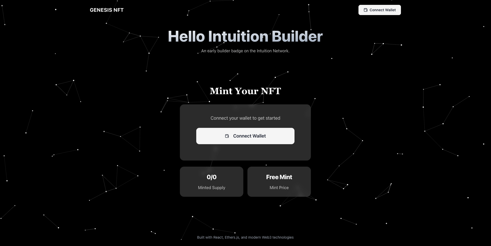
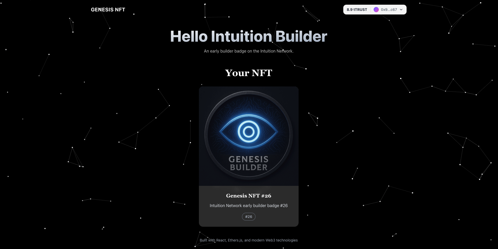
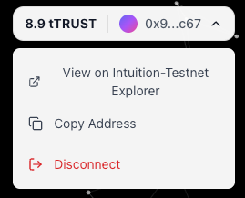
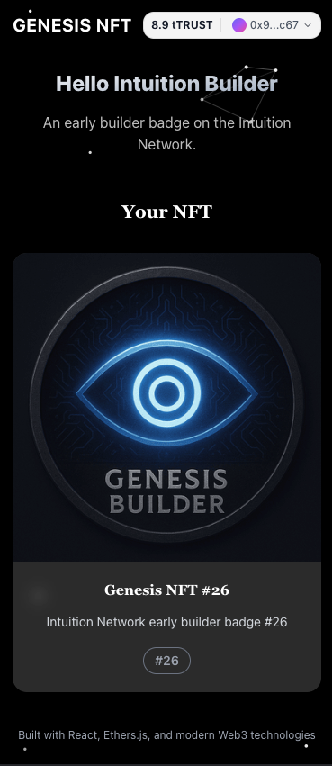

# 👁️ Genesis NFT - Intuition Builder Badge <span style="color: #FFD700;">$</span>

A modern NFT minting platform built for the Intuition Network, featuring a sophisticated glassmorphism UI and constellation animation background. This application allows early builders to mint their Genesis Builder badges on the Intuition Testnet.

## Screenshots

<div align="center">

### Main Interface

</div>

<p align="center">

<br>
<em>Homepage with constellation animation and glassmorphism design</em>
</p>

<div align="center">

### NFT Collection Display

</div>

<p align="center">

<br>
<em>Genesis Builder NFT collection with metadata display</em>
</p>

<div align="center">

### Wallet Dropdown Menu

</div>

<p align="center">

<br>
<em>Wallet management dropdown with utilities</em>
</p>

<div align="center">

### Mobile Responsive Design

</div>

<p align="center">

<br>
<em>Mobile-optimized interface with responsive layout</em>
</p>

## Features

- **NFT Minting**: Mint Genesis Builder badges directly on Intuition Testnet
- **Wallet Integration**: Seamless MetaMask connection with automatic network switching
- **Modern UI**: Glassmorphism design with responsive layout
- **Constellation Animation**: Interactive particle system background
- **Collection Display**: View your minted NFT collection
- **Network Management**: Automatic Intuition Testnet configuration

## Tech Stack

- **Frontend**: Next.js 14 with TypeScript
- **Blockchain**: Ethers.js for Web3 integration
- **Styling**: Tailwind CSS with custom glassmorphism effects
- **Components**: Radix UI primitives
- **Icons**: Lucide React
- **Network**: Intuition Testnet

## Getting Started

### Prerequisites

- Node.js 18+
- MetaMask or compatible Web3 wallet
- pnpm (recommended) or npm

### Installation

1. Clone the repository:

```bash
git clone <repository-url>
cd builders-og
```

2. Install dependencies:

```bash
pnpm install
# or
npm install
```

3. Start the development server:

```bash
pnpm dev
# or
npm run dev
```

4. Open [http://localhost:3000](http://localhost:3000) in your browser

### Build for Production

```bash
pnpm build
pnpm start
```

## Network Configuration

The application automatically configures the Intuition Testnet:

- **Network Name**: Intuition Testnet
- **RPC URL**: https://testnet.rpc.intuition.systems/http
- **Chain ID**: 13579 (0x350B)
- **Currency**: tTRUST
- **Explorer**: https://testnet.explorer.intuition.systems

### Manual Network Setup

If automatic network addition fails, add these details manually to your wallet:

1. Open wallet settings
2. Navigate to "Networks" or "Add Network"
3. Enter the network details above
4. Save and switch to Intuition Testnet

## Smart Contract

- **Contract Address**: `0xc2caa430DbfC1A7c381D54D735Ed9c55fD4112A8`
- **Network**: Intuition Testnet
- **Type**: ERC-721 NFT Contract

### Contract Functions

- `mint()`: Mint a new Genesis Builder NFT
- `totalMinted()`: Get total number of minted NFTs
- `maxSupply()`: Get maximum supply limit
- `mintOpen()`: Check if minting is currently active
- `hasMinted(address)`: Check if an address has already minted

## Project Structure

```
builders-og/
├── app/                    # Next.js 14 app directory
│   ├── globals.css        # Global styles
│   ├── layout.tsx         # Root layout
│   └── page.tsx          # Main NFT minting page
├── components/            # Reusable UI components
│   ├── ui/               # Base UI components (Button, Card, etc.)
│   └── theme-provider.tsx
├── lib/                   # Utility functions
├── public/               # Static assets
│   └── genesis-nft.png   # NFT placeholder image
├── styles/               # Additional styling
└── package.json
```

### Responsive Design

- Mobile-first approach
- Breakpoints: xs, sm, md, lg, xl
- Adaptive layouts
- Touch-friendly interactions

## License

This project is licensed under the MIT License.

---

🚀 Built with Web3 innovation and trust on the Intuition Network ✨
